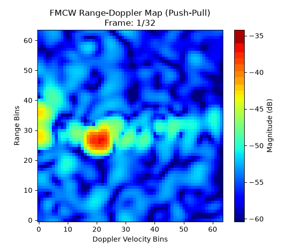
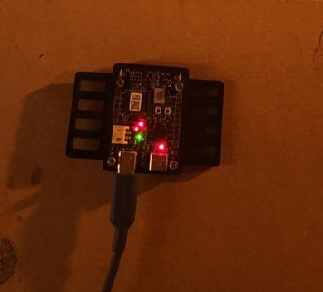
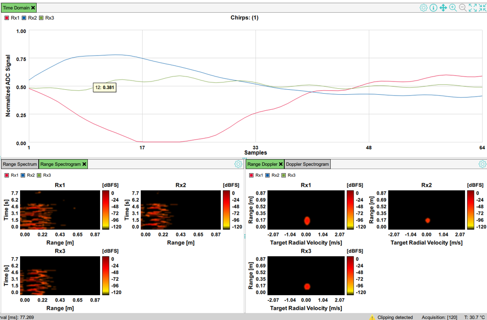
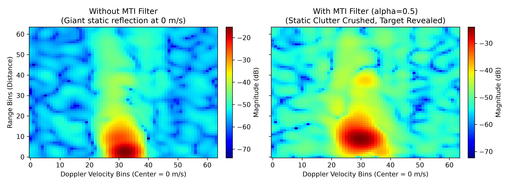
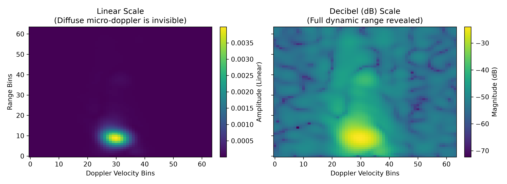
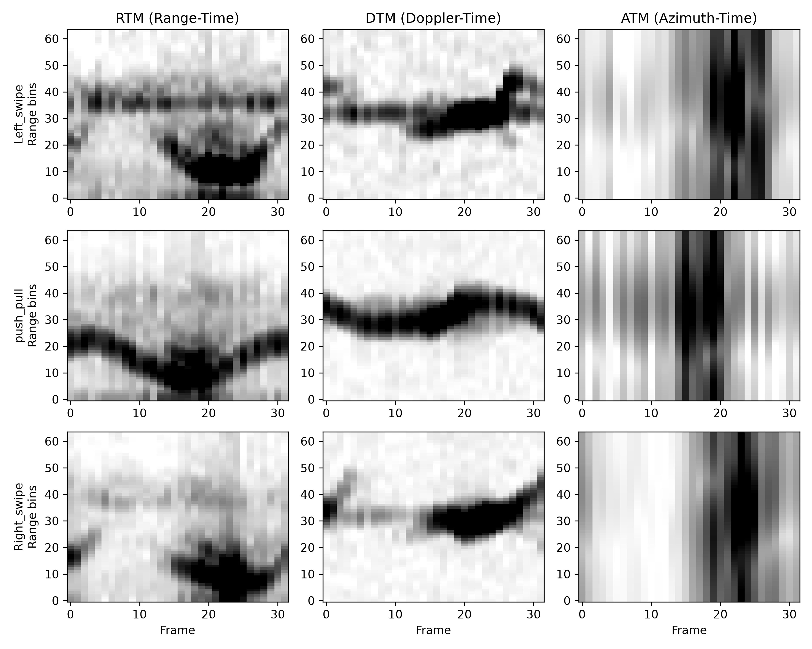
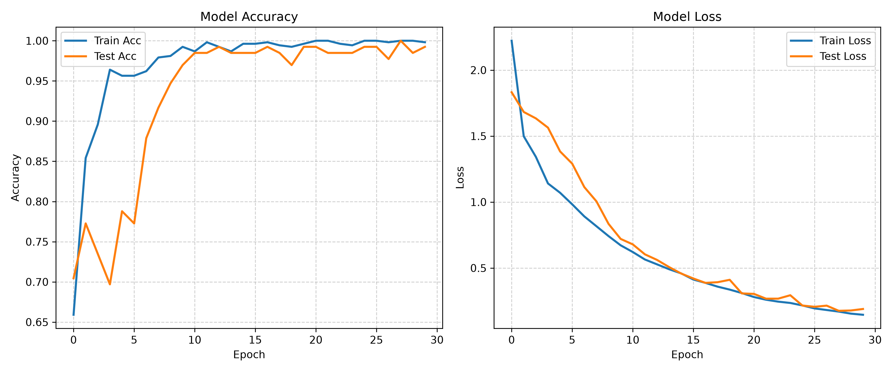
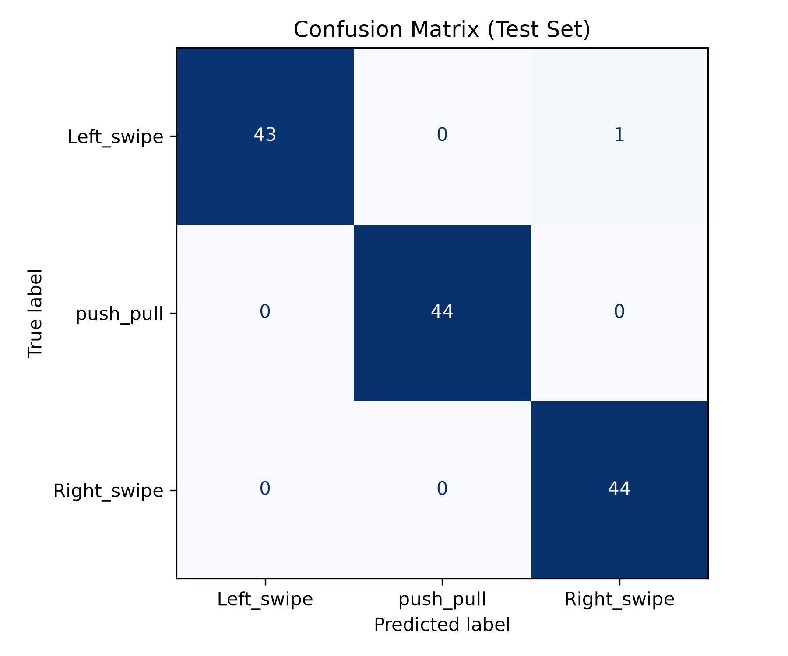

[](#)
[](#)
[](#)
[](#)
[](#)
[](#)
[](#)
# FMCW Radar Gesture Recognition

A machine learning pipeline developed as a university laboratory project for recognizing human hand gestures using Frequency-Modulated Continuous Wave (FMCW) radar.

<div align="center">
  
  <br>
  <em>Range-Doppler Map of a "Push-Pull" gesture captured and processed via the DSP pipeline.</em>
</div>

## Hardware Setup and Data Acquisition

Data was collected using the Infineon CY8CKIT-062S2-AI evaluation board, featuring the BGT60TR13C 60GHz radar sensor (1 Tx, 3 Rx antennas). 

<div align="center">
  
  
</div>
<br>

*Left: The 60GHz radar sensor setup. Right: The Infineon Radar Fusion GUI streaming Time-Domain and Range-Doppler features.*

---

## Repository Structure

```text
gesture_radar/
├── data/                   # local dataset and sample exports
├── src/
│   ├── data/               # DSP data preparation and feature extraction
│   ├── helpers/            # radar DSP primitives
│   ├── models/             # model definitions
│   ├── animate.py          # animation rendering for range-doppler maps
│   ├── config.py          # global constants and hyperparameters
│   ├── train.py            # training pipeline
│   ├── visualize.py       # feature visualization
│   └── visualize_dsp.py    # DSP diagnostic plots
├── assets/                 # generated figures and demos
├── requirements.txt        # Python dependency pin suggestions
├── pyproject.toml          # packaging metadata and pytest config
├── Makefile                # convenience commands
└── README.md               # project documentation
```

## Digital Signal Processing (DSP) Pipeline

Feeding raw radar ADC data directly into a Convolutional Neural Network (CNN) is suboptimal due to background clutter and signal properties. A custom DSP pipeline was implemented to extract physically relevant features.

### 1. Removing Static Clutter (MTI Filter)
Radar waves reflect off stationary objects in the room (walls, desks), creating a large DC bias at the 0 m/s Doppler bin. An Exponential Moving Average (EMA) Moving Target Indicator (MTI) filter ($\alpha = 0.5$) was applied to suppress static clutter and isolate the moving hand.

<div align="center">
  
</div>

### 2. Linear vs. Logarithmic (dB) Scaling
Radar signals exhibit a high dynamic range. Weak reflections (such as the diffuse micro-Doppler edges of a hand) are mathematically overshadowed by specular reflections. Converting the 2D FFT arrays into a Decibel (dB) scale exposes the full physical footprint of the gesture to the neural network.

<div align="center">
  
</div>

### 3. Azimuth Correction for L-Shaped Arrays
The BGT60TR13C features an L-shaped antenna array (3 Rx antennas). Applying a standard Digital Beamforming (DBF) algorithm to all three antennas assumes a Uniform Linear Array (ULA), which introduces phase errors. The pipeline explicitly isolates the horizontal pair (Rx1 and Rx3) to maintain correct azimuth tracking for lateral movements.

---

## Feature Engineering

To process the 3D tensor over time using standard 2D CNNs, the data is aggregated into three multi-channel images per gesture:
* **RTM (Range-Time Map):** Distance over time.
* **DTM (Doppler-Time Map):** Velocity over time.
* **ATM (Azimuth-Time Map):** Angle over time.



---

## Neural Network Architecture

The classification model is a 2D Convolutional Neural Network built in TensorFlow/Keras. 

**Architectural Details:**
1. **Instance-Wise Normalization:** Standard scaling is applied per-gesture rather than globally across the dataset. This reduces the network's reliance on absolute signal strength, which varies based on user distance and room size, encouraging the model to learn relative temporal shapes.
2. **Spatial Preservation:** Instead of using `GlobalAveragePooling2D` (which averages out the time and angle dimensions, making directional gestures indistinguishable), a `Flatten()` layer is used to maintain the spatial-temporal coordinates.
3. **Data Augmentation:** A 5% `RandomTranslation` is applied during training to improve translation invariance.

## Results

The model successfully separates the gesture classes based on the extracted physics-based signatures.

<div align="center">
  
  
</div>

## How to Run

1. **Install Dependencies:**
   ```bash
   python -m venv venv
   source venv/bin/activate
   pip install -r requirements.txt
   ```
2. **Process Raw Data and Build Dataset:**
   ```bash
   python -m src.data.extract
   python -m src.data.build
   ```
3. **Train the Model:**
   ```bash
   python -m src.train
   ```

## Acknowledgements and License
The radar DSP helper scripts (`DigitalBeamForming.py`, `DopplerAlgo.py`, etc.) are provided under the BSD 3-Clause License by Infineon Technologies AG.
